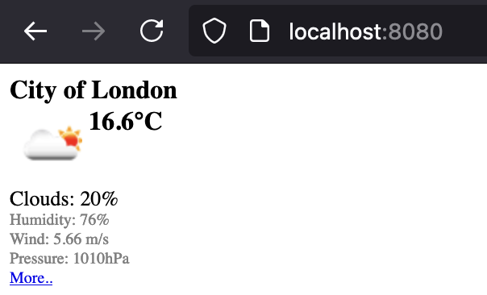

# Sample Python weather webserver

A sample weather web server written in Python that retrieves data from [OpenWeather](https://openweathermap.org/current) about the current weather in London.

## Repo structure
- `app` - Flask app module

## Available endpoints
- `/` - returns information about the current weather in London in HTML format
- `/ping` - returns PONG in HTML format
- `/health` - returns health status in JSON format

## Prerequisites
Create a local copy of `.env` file and update `API_KEY` variable to your value:
```
cp .env.example .env
```

## How to run the app locally with Docker
On the current durectory run the following command to build an image:
```
docker build -t localhost:weather .
```
Run docker image:
```
docker run --rm -p 8080:8080 -d --name web localhost:weather
```
Open your browser at `http://localhost:8080` and browse the app webpage.

You can check the app logs by running:
```
docker logs web
```
After the job is complete, run the following command to stop docker container (it will be removed, since the container was launched with `--rm` flag):
```
docker stop web
```

## How to deploy the app locally

Local deployment is done using **minikube** and **skaffold** for deploying helm charts to the cluster

> - **Minikube** installation guide: https://minikube.sigs.k8s.io/docs/start/
> - **Skaffold** installation guide: https://skaffold.dev/docs/install/

### Setup
Start minikube with a custom profile and configure skaffold:
```
minikube start --profile custom
```
On a shell where Skaffold is executed, run the following commands:
```
source <(minikube docker-env -p custom)
skaffold config set --kube-context custom local-cluster true
skaffold dev
```
Run on a separate terminal (Do not close the terminal window!):
```
minikube tunnel -p custom
```
Check the external IP on the service:
```
kubectl get svc -n app
```
```
❯ kubectl get svc -n app
NAME      TYPE           CLUSTER-IP    EXTERNAL-IP   PORT(S)          AGE
weather   LoadBalancer   10.104.74.2   127.0.0.1     8080:31437/TCP   17s
```
Note that without minikube tunnel, Kubernetes will show the external IP as “pending”:
```
❯ kubectl get svc -n app
NAME      TYPE           CLUSTER-IP    EXTERNAL-IP   PORT(S)          AGE
weather   LoadBalancer   10.104.74.2   <pending>     8080:31437/TCP   2s
```
Open your browser at `http://<REPLACE_WITH_EXTERNAL_IP>:8080`, for example `http://127.0.0.1:8080` and browse the app webpage:



### How to test the Ingress locally
Run the following command to enable NGINX Ingress controller on minikube cluster:
```
minikube addons enable ingress -p custom
```
Open helm chart values and set `ingress.enabled` to `true`:
```
...
ingress:
  enabled: true
...
```

Add a line to the bottom of the `/etc/hosts` file:
```
127.0.0.1 weather-app.local
```

Visit `weather-app.local` from your browser. Another value for ingress can be set and configured on the [helm chart](../helm/weather/values.yaml).
